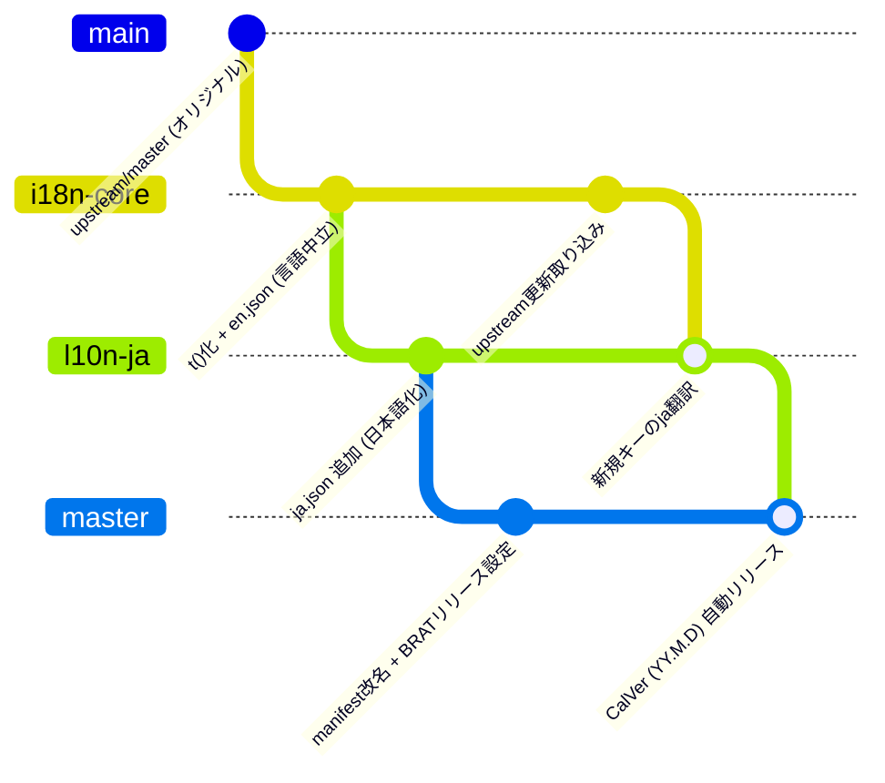

# obsidian-i18n-ops

英語のみに対応しているObsidianプラグインを多言語化（日本語化）し、GitHub Actions + Google Jules / Antigravity によって継続的・自動的にアップデートを追従するための汎用運用基盤リポジトリです。

---

## 🎯 目的と特徴

- **完全な汎用基盤**: 特定のプラグインに依存せず、任意のObsidianプラグインに適用可能。
- **3層ブランチ戦略**:
  - `i18n-core`: 言語中立なi18n化層（将来upstreamへのPR還元が可能）
  - `l10n-ja`: 日本語辞書リソース層（他言語の追加も容易）
  - `main` / `master`: BRAT配布用設定（manifest改名、CalVerリリースCI）
- **プラグイン衝突防止（manifest改名）**: `id: "<id>-i18n"` と `name: "<Name> (i18n)"` を設定し、Obsidian上でオリジナル版と共存・区別可能。
- **原文キー方式（Raw Key Approach）**: `t("Original English Text")` を採用し、Zero-dependencyの薄いi18nアダプター（`templates/i18n.ts`）で動作。
- **決定論的CIチェック**: `scripts/check-i18n.mjs` により、キー過不足や `{placeholder}` の整合性を自動検証。
- **CalVer日付バージョン & BRAT対応**: 日付バージョン（`YY.M.D` 形式）を採用し、GitHub Releases経由で **Obsidian42 - BRAT** からワンクリック導入・更新可能。

---

## 🌳 3層ブランチアーキテクチャ



---

## ⚙️ GitHub Actions ワークフローの汎用設計＆分類指針

フォーク先リポジトリにおいて upstream（本家）のワークフローとの衝突を防ぎ、CI時間を最小化して更新追従を安定させるため、ワークフローを**4象限分類ルール**に従って運用します。詳細は [docs/ci-workflow-guidelines.md](docs/ci-workflow-guidelines.md) を参照してください。

| 分類 | 判定基準・対象例 | フォーク先での扱い | 理由 |
| :--- | :--- | :---: | :--- |
| **① 本家専用・外部依存** | `release-prepare.yml`, `publish.yml`, `docs.yml`, `pr-title.yml` 等 | **`gh workflow disable` (無効化)** | フォーク先では権限やSecretsが存在せず失敗するため。削除・改変せず無効化することでupstream同期時のコンフリクトを防止。 |
| **② 重厚・過剰テスト** | `codeql.yml`, `dependency-review.yml`, OSマトリクス（macOS/Windows） | **`gh workflow disable` (無効化)** | 多言語化フォークでは不要な重い解析・テストを止め、CI待ち時間と無料枠消費を削減。 |
| **③ 多言語化高速CI** | [`templates/i18n-ci.yml`](templates/i18n-ci.yml) | **新設 (Active)** | 本家CIと分離し、Ubuntu単一環境で `check-i18n` + `build` + 単体テストを1〜2分で高速実行。 |
| **④ BRAT配布リリース** | [`templates/brat-release.yml`](templates/brat-release.yml) | **新設 (Active)** | 日付タグ（`YY.M.D`）によるアセット付きReleaseを発行。`styles.css` がないプラグインにも完全対応。 |

---

## 📁 ディレクトリ構成

```
obsidian-i18n-ops/
├── .github/workflows/
│   └── reusable-upstream-sync.yml  # 再利用可能GitHub Actionsワークフロー
├── glossary/                       # 汎用対訳集・翻訳ルール
│   ├── obsidian-ja.json            # Obsidian公式UI標準用語集
│   └── I18N.md                     # スタイルガイド & 翻訳ルール
├── templates/                      # プラグイン配置用汎用テンプレート
│   ├── i18n.ts                     # 軽量i18nアダプター（Zero-dependency）
│   ├── i18n-ci.yml                 # 多言語化フォーク用高速CI
│   ├── brat-release.yml            # BRAT用CalVer自動リリースワークフロー
│   └── upstream-sync.yml           # プラグイン用upstream同期ワークフロー
├── scripts/                        # 検証スクリプト
│   └── check-i18n.mjs              # 辞書・プレースホルダー検証スクリプト
├── prompts/                        # AI指示書
│   ├── antigravity-init.md         # 初回全コードi18n化用指示書（Antigravity用）
│   └── jules-sync.md               # 日々の差分同期用指示書（Google Jules用）
└── docs/                           # 設計書および運用指針
    ├── ci-workflow-guidelines.md   # CIワークフロー設計・判定指針
    └── todo.md                     # 検討・検証課題
```

---

## 🚀 プラグインへの適用手順

任意の英語プラグインを多言語化する際は、[prompts/antigravity-init.md](prompts/antigravity-init.md) を参照して実行します。
