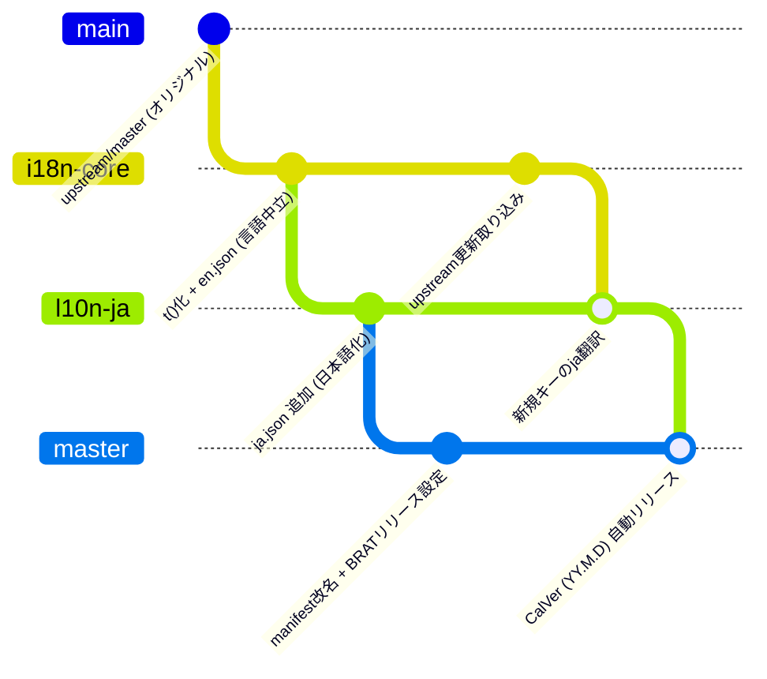

# obsidian-i18n-ops

英語のみに対応しているObsidianプラグインを多言語化（日本語化）し、GitHub Actions + Google Jules / Antigravity によって継続的・自動的にアップデートを追従するための汎用運用基盤リポジトリです。

---

## 🎯 目的と特徴

- **完全な汎用基盤**: 特定のプラグインに依存せず、任意のObsidianプラグインに適用可能。
- **3層ブランチ戦略**:
  - `i18n-core`: 言語中立なi18n化層（将来upstreamへのPR還元が可能）
  - `l10n-ja`: 日本語辞書リソース層（他言語の追加も容易）
  - `main` / `master`: BRAT配布用設定（manifest改名、CalVerリリースCI）
- **プラグイン衝突防止（manifest改名）**: `id: "<id>-i18n"` と `name: "<Name> (i18n)"` を設定し、Obsidian上でオリジナル版と共存・区別可能。
- **原文キー方式（Raw Key Approach）**: `t("Original English Text")` を採用し、Zero-dependencyの薄いi18nアダプター（`templates/i18n.ts`）で動作。
- **決定論的CIチェック**: `scripts/check-i18n.mjs` により、キー過不足や `{placeholder}` の整合性を自動検証。
- **CalVer日付バージョン & BRAT対応**: 日付バージョン（`YY.M.D` 形式）を採用し、GitHub Releases経由で **Obsidian42 - BRAT** からワンクリック導入・更新可能。

---

## 🌳 3層ブランチアーキテクチャ



---

## ⚙️ GitHub Actions ワークフローの3分類運用設計

フォーク先リポジトリにおいて upstream（本家）のワークフローとの衝突を防ぎ、更新追従時に壊れないようにするため、ワークフローを以下の3つに明確に分類して運用します。

| 分類 | ワークフロー例 | フォーク先での扱い | 理由 |
| :--- | :--- | :---: | :--- |
| **① そのまま利用 (Active)** | `ci.yml`, `test.yml`, `codeql.yml` | **有効のまま維持** | upstream のコード更新や自前の差分取り込み時、ビルド・テスト・Lint の品質を自動検証するために活用。 |
| **② 無効化＆代理作成 (Replace)** | 公式コミュニティ公開用 `release.yml` | **無効化 ＋ BRAT用作成** | 本家のリリースフローを `gh workflow disable` で止め、代理として CalVer 日付リリースの [`templates/release.yml`](templates/release.yml) を配置。 |
| **③ 完全無効化 (Disable & Ignore)** | `release-prepare.yml`, `docs.yml`, `stale.yml` | **無効化（コード改変なし）** | 本家作者専用の GitHub App / 権限 / Bot に依存するワークフロー。コードを削除・変更せず `gh workflow disable` で停止し、upstream 更新時のマージコンフリクトを原理的に防止。 |

---

## 📁 ディレクトリ構成

```
obsidian-i18n-ops/
├── .github/workflows/
│   └── reusable-upstream-sync.yml  # 再利用可能GitHub Actionsワークフロー
├── glossary/                       # 汎用対訳集・翻訳ルール
│   ├── obsidian-ja.json            # Obsidian公式UI標準用語集
│   └── I18N.md                     # スタイルガイド & 翻訳ルール
├── templates/                      # プラグイン配置用テンプレート
│   ├── i18n.ts                     # 軽量i18nアダプター（Zero-dependency）
│   ├── release.yml                 # BRAT用自動リリースワークフロー
│   └── upstream-sync.yml           # プラグイン用CI設定テンプレート
├── scripts/                        # 検証スクリプト
│   └── check-i18n.mjs              # 辞書・プレースホルダー検証スクリプト
├── prompts/                        # AI指示書
│   ├── antigravity-init.md         # 初回全コードi18n化用指示書（Antigravity用）
│   └── jules-sync.md               # 日々の差分同期用指示書（Google Jules用）
└── docs/                           # 設計書および検討履歴
```

---

## 🚀 プラグインへの適用手順

任意の英語プラグインを多言語化する際は、[prompts/antigravity-init.md](prompts/antigravity-init.md) を参照して実行します。
