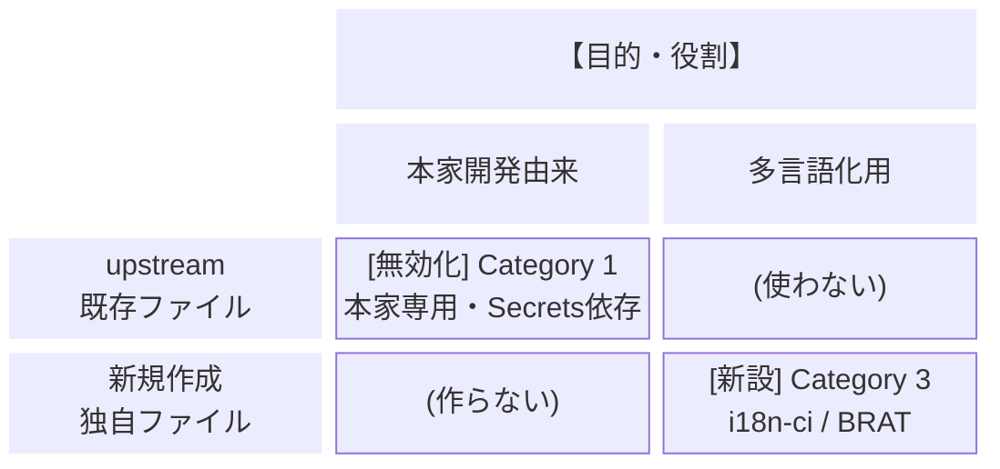
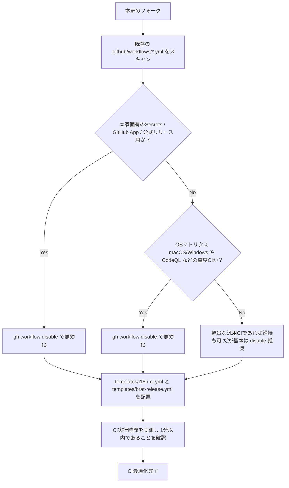

# 多言語化フォークにおける GitHub Actions ワークフロー設計＆判定指針

本ドキュメントは、英語のみに対応している任意の Obsidian コミュニティプラグインを多言語化フォークする際に、**「どのワークフローを無効化し、どのワークフローを新設・運用すべきか」** を判定するための汎用的な設計思想、分類ルール、およびCI実行時間の過剰動作防止指針を定めたものです。

---

## 1. 基本方針・設計思想

1. **upstream（本家）ワークフローの不可侵原則**:
   - 本家のワークフローファイル（`.github/workflows/*.yml`）を直接編集・削除してはならない。
   - 不要な本家ワークフローは、GitHub Actionsの機能（`gh workflow disable`）を用いて無効化する。
   - これにより、本家からの `upstream-sync` 時にワークフローのコンフリクトが原理的に発生しなくなる。
2. **多言語化フォークの主目的への特化とテスト最小化**:
   - フォークリポジトリの目的は「UI文字列の多言語化の維持」および「BRAT（Beta Reviewers Auto-update Tester）経由での配布」である。
   - 本家開発に必要な「重厚なOSマトリクステスト」「CodeQL解析」「数千件に及ぶ内部ロジック単体テスト」は日常CIから除外し、多言語化に必要な検証のみに絞り込む。
3. **CI実行時間の実測と過剰動作防止の義務化**:
   - CIやビルドパイプラインを構築・変更する際は、必ず各ステップの実行時間を実測・記録し、1分以内に完了する高速性を維持する。
4. **完全なZero-Config / 汎用フォールバック設計**:
   - 多言語化専用のCIおよびリリースワークフローは、プラグインごとの違い（`pnpm` / `npm` / `yarn` / `bun`、`styles.css` の有無、Lintスクリプト名の違いなど）を自動検出し、どのプラグインでも無変更で動作するように設計する。

---

## 2. 多言語化フォークにおけるテスト最小化指針

### 多言語化で発生しうるリスクと必要十分な検証手段

多言語化（`t()` 化および辞書追加）において発生しうるリスクは以下の3点に限定されます。

| 発生しうるリスク | 検知手段 | 所要時間 | 自動CIでの扱い |
| :--- | :--- | :---: | :---: |
| **① 翻訳キーの欠落・プレースホルダー破損** | `check-i18n` | **約2秒** | **必須 (必須実行)** |
| **② `t()` の構文ミス・型不整合・インポート漏れ** | `check` / `lint`（型・構文チェック） | **約15秒** | **必須 (必須実行)** |
| **③ バンドル生成・CSSのビルド失敗** | `build`（esbuild） | **約7秒** | **必須 (必須実行)** |
| ④ プラグイン内部ロジック（マクロ、AIプロンプト等） | `test`（数千件の単体テスト） | **約4〜5分** | **除外 (ローカル/手動のみ)** |

### 本家の単体テスト（`test`）を日常CIから除外する理由

- 本家の単体テストは、プラグイン本体の機能改修やリファクタリング時に開発者が通すためのものです。
- UI文字列を `t("English")` に差し替えるだけの作業において、ロジック破壊が起こる可能性は型チェック（`tsc` / `svelte-check`）でほぼ100%検出されます。
- 単体テストを日常CIに含めると、CI実行時間が5分以上に膨れ上がり、開発サイクルを圧迫します。
- **結論**: 単体テストは **「ローカル開発時に必要な時のみ実行」** または **「`workflow_dispatch` で明示的に `run_tests: true` を指定した時のみ実行」** とします。

---

## 3. ワークフロー4象限分類マトリクス（判定基準）

フォーク元（upstream）に存在する各ワークフローは、以下の基準に従って分類・対応します。



| カテゴリ | 判定条件（ファイル内の特徴） | フォーク先での対応 | 理由・効果 |
| :--- | :--- | :---: | :--- |
| **Category 1: 本家固有・外部認証依存フロー** | ・`secrets.RELEASE_*` や GitHub App 連携を使用<br>・公式コミュニティ登録リポジトリへのPR作成<br>・ドキュメントサイト（Pages, Vercel等）デプロイ<br>・PRタイトル検証、Stale bot 等 | **`gh workflow disable` (無効化)** | フォーク先では権限やSecretsが存在せず失敗するため。コードを削除・改変せず無効化することでupstream同期時のコンフリクトを防止。 |
| **Category 2: 過剰・重複テストフロー** | ・`strategy.matrix.os` で macOS / Windows を実行<br>・CodeQL 静的コード解析<br>・Dependency Review | **`gh workflow disable` (無効化)** | 多言語化差分においてOS固有の挙動破壊が起きる可能性は極めて低く、CIの待ち時間を悪化させるため。 |
| **Category 3: 多言語化高速CI** | ・辞書整合性検証（`check-i18n`）<br>・型/構文チェック（`check` / `lint`）<br>・プラグインビルド（`build`） | **`templates/i18n-ci.yml` を新設** | 本家のCIファイルを壊さず、`ubuntu-latest` 単一環境でキャッシュを活用して **30秒〜45秒** で高速完結させる。 |
| **Category 4: BRAT配布リリース** | ・日付タグ（CalVer: `YY.M.D` / 同日2回目以降は `YY.M.D.N`）によるアタッチメント付きGitHub Release発行 | **`templates/brat-release.yml` を新設** | 本家のSemVerリリースとは独立して、BRAT（`manifest.json`, `main.js`, `styles.css`）用配布を **40秒前後** で完結させる。 |

---

## 4. CI実行時間の実測・過剰動作防止ルール

CIワークフローを設計・再検討・更新する際は、必ず以下の**「時間測定・過剰動作チェック」**を実施してください。

### ① 目標基準時間

- **`i18n CI`（プッシュ / PR時）**: **1分以内（目標: 30〜45秒）**
- **`Release for BRAT`（タグプッシュ時）**: **1分以内（目標: 40〜50秒）**

### ② ボトルネック特定と削減チェックリスト

もし実行時間が1分を大幅に超過している場合、以下の原因を調査して過剰動作を排除します：

1. **重い単体テスト（`pnpm test` 等）が走っていないか？** ➔ `run_tests == true` のオプショナル条件に移動。
2. **OSマトリクス（macOS / Windows）が有効になっていないか？** ➔ `ubuntu-latest` 単一環境に統一。
3. **パッケージマネージャーのキャッシュが効いているか？** ➔ `actions/setup-node` の `cache` オプションを確認。
4. **不要なドキュメントビルドやE2Eテストが走っていないか？** ➔ `package.json` の `build` スクリプト内容を精査。

---

## 5. 初期セットアップ時のワークフロー判定フロー（AI / 開発者向け）

フォークリポジトリを初期化する際は、以下のフローに従って判定と設定を行います。



### 具体的な判定チェックリスト

1. **無効化すべきファイル例**:
   - `release-prepare.yml`, `release-trigger.yml`, `publish.yml`（本家専用リリース）
   - `codeql.yml`, `codeql-analysis.yml`（セキュリティ解析）
   - `dependency-review.yml`, `dependabot.yml`（依存関係チェック）
   - `pr-title.yml`, `lint-pr.yml`（PR規約チェック）
   - `docs.yml`, `pages.yml`（ドキュメントビルド）
   - `ci.yml`, `test.yml`（OSマトリクスや重いテストが含まれる場合）
2. **配置すべきファイル**:
   - `.github/workflows/i18n-ci.yml`（`templates/i18n-ci.yml` よりコピー）
   - `.github/workflows/brat-release.yml`（`templates/brat-release.yml` よりコピー）
   - `.github/workflows/upstream-sync.yml`（`templates/upstream-sync.yml` よりコピー）

---

## 6. BRAT配布における仕様と注意点

### ① `manifest.json` のバージョン同期 & CalVer 命名規則

- BRATはリポジトリの最新リリースに添付された `manifest.json` の `version` 文字列とローカルのバージョンを比較してアップデートを判定します。
- そのため、リリースを発行する際は **`manifest.json` の `version` と Git タグ名が完全に一致していること** が必須です。
- **バージョニング規則（CalVer）**:
  - **当日初回リリース**: `YY.M.D`（例: `26.8.26`）
  - **同日2回目以降のリリース**: `YY.M.D.N`（例: `26.8.26.1`, `26.8.26.2`）
  - **ハイフン禁止の理由**: `26.8.26-1` のようなハイフン形式は、SemVer 2.0.0 仕様により「プレリリース（正式版より古い）」と判定され、BRATによるアップデート検知が機能しなくなります。必ずピリオド式（`.1`, `.2`）でリビジョン番号を付与してください。

### ② `styles.css` の有無への汎用耐性

- プラグインによってはCSSファイルが存在しない（JS単体）場合があります。
- `templates/brat-release.yml` では `fail_on_unmatched_files: false` を指定しているため、`styles.css` が存在しないプラグインでもエラーにならず正常にリリースが作成されます。

### ③ GitHub Actions の権限（Workflow Permissions）

- フォークリポジトリでは `GITHUB_TOKEN` の権限がデフォルトで制限されている場合があります。
- リポジトリの **Settings ➔ Actions ➔ General ➔ Workflow permissions** で **「Read and write permissions」** を有効にする必要があります。
- CLI コマンド:

  ```bash
  gh api -X PUT repos/<owner>/<repo>/actions/permissions/workflow -f default_workflow_permissions=write
  ```

### ④ master ブランチ保護ルールセット（Ruleset）の自動設定

- 翻訳フォークでは、以下の目的のために `master` ブランチ保護を行います:
  - **誤削除防止 (`deletion`)** & **誤った Force push 防止 (`non_fast_forward`)**
  - **GitHub Actions (`upstream-sync.yml`) および管理者による自動 push のバイパス許可 (`bypass_actors`)**
- `scripts/setup-repo-security.ps1`（または `.sh`）を実行することで、Workflow 権限と Ruleset の両方を一括で自動適用できます:

  ```powershell
  pwsh scripts/setup-repo-security.ps1 -Repo "<owner>/<repo>"
  ```
