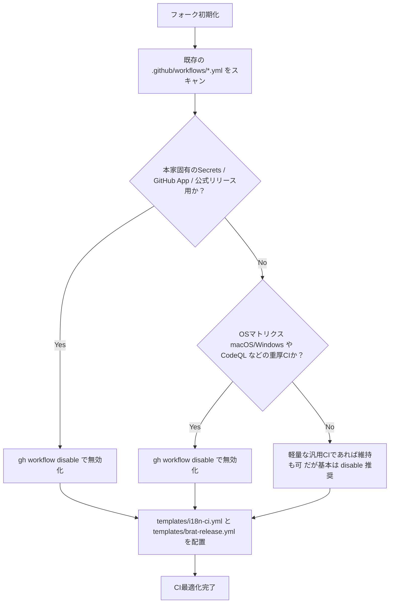

# 多言語化フォークにおける GitHub Actions ワークフロー設計＆判定指針

本ドキュメントは、英語のみに対応している任意の Obsidian コミュニティプラグインを多言語化フォークする際に、**「どのワークフローを無効化し、どのワークフローを新設・運用すべきか」** を判定するための汎用的な設計思想と分類ルールを定めたものです。

---

## 1. 基本方針・設計思想

1. **upstream（本家）ワークフローの不可侵原則**:
   - 本家のワークフローファイル（`.github/workflows/*.yml`）を直接編集・削除してはならない。
   - 不要な本家ワークフローは、GitHub Actionsの機能（`gh workflow disable`）を用いて無効化する。
   - これにより、本家からの `upstream-sync` 時にワークフローのコンフリクトが原理的に発生しなくなる。
2. **多言語化フォークの主目的への特化**:
   - フォークリポジトリの目的は「UI文字列の多言語化の維持」および「BRAT（Beta Reviewers Auto-update Tester）経由での配布」である。
   - 本家開発に必要な「重厚なOSマトリクステスト」「CodeQL解析」「公式コミュニティへのリリース手続き」は不要であり、CIリソース（無料枠）と実行時間を浪費する原因となる。
3. **完全なZero-Config / 汎用フォールバック設計**:
   - 多言語化専用のCIおよびリリースワークフローは、プラグインごとの違い（`pnpm` / `npm` / `yarn` / `bun`、`styles.css` の有無、Lintスクリプト名の違いなど）を自動検出し、どのプラグインでも無変更で動作するように設計する。

---

## 2. ワークフロー4象限分類マトリクス（判定基準）

フォーク元（upstream）に存在する各ワークフローは、以下の基準に従って分類・対応します。

```
                    【目的・役割】
              多言語化・配布用  │  本家開発・公式配布用
           ┌───────────────────┼───────────────────┐
  upstream │ (使わない)        │ [無効化] Category 1│
  既存ファイル│                   │ 本家専用・Secrets依存│
           ├───────────────────┼───────────────────┤
  新規作成 │ [新設] Category 3  │ (作らない)        │
  独自ファイル│ i18n-ci / BRAT    │                   │
           └───────────────────┴───────────────────┘
```

| カテゴリ | 判定条件（ファイル内の特徴） | フォーク先での対応 | 理由 |
| :--- | :--- | :---: | :--- |
| **Category 1: 本家固有・外部認証依存フロー** | ・`secrets.RELEASE_*` や GitHub App 連携を使用<br>・公式コミュニティ登録リポジトリへのPR作成<br>・ドキュメントサイト（Pages, Vercel等）デプロイ<br>・PRタイトル検証、Stale bot 等 | **`gh workflow disable` (無効化)** | フォーク先では権限やSecretsが存在せず必ず失敗する。また、フォーク側はBRAT配布が主目的のため不要。 |
| **Category 2: 過剰・重複テストフロー** | ・`strategy.matrix.os` で macOS / Windows を実行<br>・CodeQL 静的コード解析<br>・Dependency Review | **`gh workflow disable` (無効化)** | 多言語化差分においてOS固有の挙動破壊が起きる可能性は極めて低く、CIの無料枠消費と待ち時間を悪化させるため。 |
| **Category 3: 多言語化高速CI** | ・辞書整合性検証（`check-i18n`）<br>・型/構文チェック（`check` / `lint`）<br>・プラグインビルド（`build`）<br>・主要単体テスト（`test`） | **`templates/i18n-ci.yml` を新設** | 本家のCIファイルを壊さず、`ubuntu-latest` 単一環境でキャッシュを活用して1〜2分以内に決定論的検証を完了させる。 |
| **Category 4: BRAT配布リリース** | ・日付タグ（CalVer: `YY.M.D`）によるアタッチメント付きGitHub Release発行 | **`templates/brat-release.yml` を新設** | 本家のSemVerリリースとは独立して、BRAT（`manifest.json`, `main.js`, `styles.css`）用配布を完結させる。 |

---

## 3. 初期セットアップ時のワークフロー判定フロー（AI / 開発者向け）

フォークリポジトリを初期化する際は、以下のフローに従って判定と設定を行います。



### 具体的な判定チェックリスト

1. **無効化すべきファイル例**:
   - `release-prepare.yml`, `release-trigger.yml`, `publish.yml`（本家専用リリース）
   - `codeql.yml`, `codeql-analysis.yml`（セキュリティ解析）
   - `dependency-review.yml`, `dependabot.yml`（依存関係チェック）
   - `pr-title.yml`, `lint-pr.yml`（PR規約チェック）
   - `docs.yml`, `pages.yml`（ドキュメントビルド）
   - `ci.yml`, `test.yml`（OSマトリクスや重いテストが含まれる場合）
2. **配置すべきファイル**:
   - `.github/workflows/i18n-ci.yml`（`templates/i18n-ci.yml` よりコピー）
   - `.github/workflows/brat-release.yml`（`templates/brat-release.yml` よりコピー）
   - `.github/workflows/upstream-sync.yml`（`templates/upstream-sync.yml` よりコピー）

---

## 4. BRAT配布における仕様と注意点

### ① `manifest.json` のバージョン同期
- BRATはリポジトリの最新リリースに添付された `manifest.json` の `version` 文字列とローカルのバージョンを比較してアップデートを判定します。
- そのため、リリースを発行する際は **`manifest.json` の `version` と Git タグ名（例: `26.8.26`）が完全に一致していること** が必須です。

### ② `styles.css` の有無への汎用耐性
- プラグインによってはCSSファイルが存在しない（JS単体）場合があります。
- `templates/brat-release.yml` では `fail_on_unmatched_files: false` を指定しているため、`styles.css` が存在しないプラグインでもエラーにならず正常にリリースが作成されます。

### ③ GitHub Actions の権限（Workflow Permissions）
- フォークリポジトリでは `GITHUB_TOKEN` の権限がデフォルトで制限されている場合があります。
- リポジトリの **Settings ➔ Actions ➔ General ➔ Workflow permissions** で **「Read and write permissions」** を有効にする必要があります。
